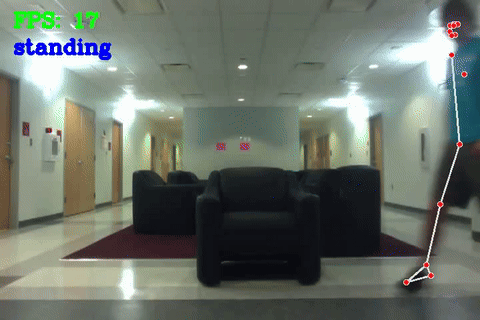

# Human Action Recognition for NVIDIA Jetbot Nano
This is my final-year industrial project for Auckland University of Technology's, Bachelor of Engineering (Honours) - Software Engineering course. This project is supervised by Sira Yongchareon.

It is a Python-based action classifier that utilizes any RGB camera, `Mediapipe Pose` to estimate and extract a person's skeletal data, and `Scikit-learn` to train the Random Forest classifier. 

## Demo
<p align="center">
  
</p>

## Installation and how to run

While this project was strictly developed under Python v3.6.9 due to the NVIDIA JetBot's restriction, I've only recently made the `requirements.txt` file, so the versions of the dependencies will adhere to modern systems.

Install the dependencies via `requirements.txt`
```bash
pip3 install -r requirements.txt
```

To run the program as is, execute the following command:
```bash
python3 __main__.py
```

## Training a new classifier
If you would like to train your own classifier:

Firstly, add the video that you'd like to use to extract the skeletal data from, and ensure that you follow the same format in the `videos` folder. Then, in `main.py`, adjust the unordered collection labelled `labelsDict` to the name of your action.

If you'd like to add more actions, then make a new folder in `videos` named `4` and add in your video in `.mp4` format.

Then, run `featureExtraction.py`
```bash
python3 featureExtraction.py
```

Once this is done, the data will then be saved to `test.pickle` under `./data/test.pickle`.

Secondly, execute `training.py`
```bash
python3 training.py
```

Once finished, `model.p` will be generated under `./model/model.p`, and will be used in `__main__.py` for the classifier

Lastly, run `__main__.py`
```bash
python3 __main__.py
```

## Acknowledgements
I'd like to thank Auckland University of Technology, for granting me the ability to learn Software Engineering, Sira Yongchareon for providing me with the opportunity to develop this project, and my friends and family for supporting me throughout my life.

## License
[MIT](https://choosealicense.com/licenses/mit/)
